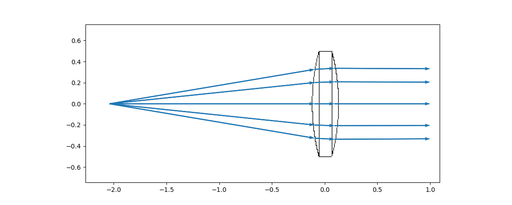

<!--
*** Thanks for checking out the Best-README-Template. If you have a suggestion
*** that would make this better, please fork the repo and create a pull request
*** or simply open an issue with the tag "enhancement".
*** Thanks again! Now go create something AMAZING! :D
***
***
***
*** To avoid retyping too much info. Do a search and replace for the following:
*** github_username, repo_name, rfrazier716, rfrazier716+pyrayt@gmail.com, project_title, project_description
-->


<!-- PROJECT SHIELDS -->
<!--
*** I'm using markdown "reference style" links for readability.
*** Reference links are enclosed in brackets [ ] instead of parentheses ( ).
*** See the bottom of this document for the declaration of the reference variables
*** for contributors-url, forks-url, etc. This is an optional, concise syntax you may use.
*** https://www.markdownguide.org/basic-syntax/#reference-style-links
-->
[![Build-Status][build-shield]][build-url]
[![Docs][docs-shield]][docs-url]
[![Version][version-shield]][version-url]
[![Contributors][contributors-shield]][contributors-url]
[![Forks][forks-shield]][forks-url]
[![Stargazers][stars-shield]][stars-url]
[![Issues][issues-shield]][issues-url]
[![MIT License][license-shield]][license-url]
[![Style][style-shield]][style-url]


<!-- PROJECT LOGO -->
<br />
<p align="center">
  <h2 align="center">PyRayT</h2>
  <p align="center">
    The Python Ray Tracer.
    <br />
    <a href="https://pyrayt.readthedocs.io"><strong>« Explore the docs »</strong></a>
    <br />
    <br />
    <a href="https://pyrayt.readthedocs.io/en/latest/tutorial.html">View Demo</a>
    ·
    <a href="https://github.com/rfrazier716/PyRayT/issues">Report Bug</a>
    ·
    <a href="https://github.com/rfrazier716/PyRayT/issues">Request Feature</a>
  </p>
</p>

## Table of Contents

- [Table of Contents](#table-of-contents)
- [About The Project](#about-the-project)
- [Getting Started](#getting-started)
- [Usage](#usage)
- [Roadmap](#roadmap)
- [Contributing](#contributing)
- [License](#license)
- [Contact](#contact)
- [Acknowledgements](#acknowledgements)

## About The Project

PyRayT is a geometric ray tracing package for optical system design. Unlike most ray tracers which focus on rendering scenes 3D scenes, PyRayT tracks every ray as it propagates through the system, storing refractive index, intersection, and collision information. This information is saved in a Pandas dataframe which can be filtered and analyzed after a trace is complete.

All components are objects that can be manipulated in 3D space, and numpy is used extensively under the hood to enable fast simulations, even when simulating 100k+ rays.



<!-- GETTING STARTED -->

## Getting Started

You can install PyRayT from PYPI with
```shell
py -m pip install pyrayt
```

For full installation instructions, follow the [Installation](https://pyrayt.readthedocs.io/en/latest/install.html) guide in the documentation.

## Usage

[A full tutorial](https://pyrayt.readthedocs.io/en/latest/tutorial.html) can be found in the documentation covering the design and analysis of a condenser lens.

<!-- ROADMAP -->

## Roadmap

PyRayT is currently in active development. Below are a couple planned features for future releases:

- Support for Chromatic Dispersion
- Support for absorbing (k!=0) materials
- Full 3D rendering of Simulation Results (think Zemax)
- Exporting designs to a portable format and reloading previous simulations
- Filtering what Rays are shown in a Ray Trace

See the [open issues](https://github.com/rfrazier716/PyRayT/issues) for a list of proposed features (and known issues).

<!-- CONTRIBUTING -->

## Contributing

Contributions are what make the open source community such an amazing place to be learn, inspire, and create. Any
contributions you make are **greatly appreciated**.

1. Fork the Project
2. Create your Feature Branch (`git checkout -b feature/AmazingFeature`)
3. Commit your Changes (`git commit -m 'Add some AmazingFeature'`)
4. Push to the Branch (`git push origin feature/AmazingFeature`)
5. Open a Pull Request

<!-- LICENSE -->

## License

Distributed under the MIT License. See [`LICENSE`](LICENSE.txt) for more information.

<!-- CONTACT -->

## Contact

[Ryan Frazier](https://www.fotonixx.com/about) - [@FotonixAndGizmo](https://twitter.com/FotonixAndGizmo)

Project Link: [https://github.com/rfrazier716/PyRayT](https://github.com/rfrazier716/PyRayT)

## Acknowledgements
* [best-README-template](https://github.com/othneildrew/Best-README-Template)


[contributors-shield]: https://img.shields.io/github/contributors/rfrazier716/pyrayt.svg?style=flat
[contributors-url]: https://github.com/rfrazier716/pyrayt/graphs/contributors

[forks-shield]: https://img.shields.io/github/forks/rfrazier716/pyrayt.svg?style=flat
[forks-url]: https://github.com/rfrazier716/pyrayt/network/members

[stars-shield]: https://img.shields.io/github/stars/rfrazier716/pyrayt.svg?style=flat
[stars-url]: https://github.com/rfrazier716/pyrayt/stargazers

[issues-shield]: https://img.shields.io/github/issues/rfrazier716/pyrayt.svg?style=flat
[issues-url]: https://github.com/rfrazier716/pyrayt/issues

[license-shield]: https://img.shields.io/github/license/rfrazier716/pyrayt.svg?style=flat
[license-url]: https://github.com/rfrazier716/pyrayt/blob/master/LICENSE.txt

[docs-shield]: https://readthedocs.org/projects/pyrayt/badge/?version=latest&style=flat
[docs-url]: https://pyrayt.readthedocs.io

[build-shield]: https://circleci.com/gh/rfrazier716/PyRayT.svg?style=shield
[build-url]: https://app.circleci.com/pipelines/github/rfrazier716/PyRayT

[version-shield]: https://img.shields.io/pypi/v/pyrayt
[version-url]: https://pypi.org/project/pyrayt/

[style-shield]: https://img.shields.io/badge/code%20style-black-000000.svg
[style-url]: https://github.com/psf/black
